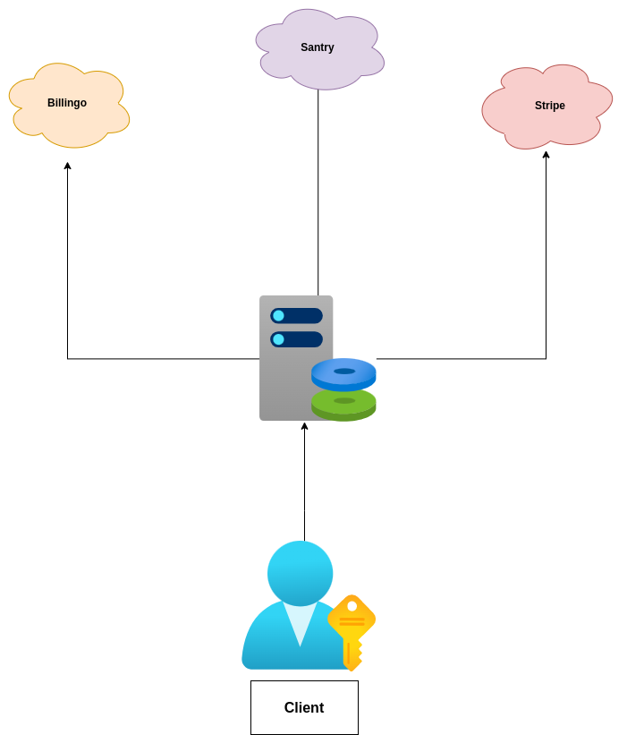

# Pupilpay

PupilPay is a closed-loop payment, lunch order, and allergy checking system specifically for schools.

Closed-loop makes the places where it can be used limited, in our case, it's restricted to the cafateria.
PupilPay is mainly a data handling service, as payments are handled by Patikapénztár (Commonly refered to as just "Patika") for in-school transactions, or another payment processor (Stripe, or Billingo) where the money goes directly to the merchant's account (Cafeteria or in-school shop).
PupilPay can easily be compared to gift card systems, let's take Starbucks for example. You open a card (open a PupilPay account), top up your balance in-store (cafeteria), and use then you can use your balance in Starbucks stores (In the cafeteria you topped up your balance).

## Table of Contents

- [Prerequisites](#prerequisites)
- [Tech Stack](#tech-stack)
- [Getting Started](#getting-started)
- [Development](#Development)
- [Resources](#resources)
- [Service Interaction Map](#service-interaction-map)

#

## Prerequisites

- Docker
- PHP@8 and up
- NPM@6 and up
- Composer@2 and up

#

## Tech Stack

#### Back-End

- Laravel 9 - PHP framework
- spatie/laravel-permission - A package for managing permissions and roles,
- maatwebsite/excel - A PHP package for reading and writing spreadsheets in Excel format
- stripe/stripe-php - Stripe PHP library, which makes it easy to integrate with Stripe's API.
- spiral/roadrunner - A high-performance PHP application server.
- simplesoftwareio/simple-qrcode - A PHP package for generating QR codes
- predis/predis - A flexible and feature-complete Redis client for PHP
- laravel/horizon - A beautiful dashboard and code-driven configuration for Laravel Redis queues,
- laravel/octane - A high-performance PHP application server for Laravel,
- hisorange/browser-detect - A PHP library that detects the browser and operating system of the client.
- sentry/sentry-laravel - The official Sentry SDK for Laravel, which provides real-time error tracking and performance monitoring,

### Front-End

- Vue.js 3 - JavaScript framework for building user interfaces
- Tailwind CSS 3 - CSS framework
- Vite 3 - Front-end build tool
- ApexCharts - Modern charting library
- Date-fns - Date utility library
- Vue-I18n - Internationalization library for Vue.js
- Vue-Multiselect - Vue.js component for multi-select fields
- Pinia - Intuitive, type safe store for Vue.js
- vueuse - Collection of essential Vue 3 composition functions
- qrcode.vue - Vue.js component for generating QR codes
- vee-validate - Template-based validation framework for Vue.js
- axios - Promise-based HTTP client
- eslint - JavaScript linter
- floating-ui/dom - A minimal and customizable UI library
- headlessui/vue - Completely unstyled, fully accessible UI components
- heroicons/vue - Beautiful hand-crafted SVG icons, by the makers of Tailwind CSS
- sentry/tracing - Application performance monitoring

#

## Getting Started

1\. First of all you need to clone Pupilpay repository from github:

```sh
git clone https://github.com/PupilPay/Portal.git
```

2\. Next step requires you to run _composer install_ in order to install all the dependencies.

```sh
composer install
```

3\. after you have installed all the PHP dependencies, it's time to install all the JS dependencies:

```sh
npm install
```

and also:

```sh
npm run dev
```

4\. Now we need to set our env file. Go to the root of your project and execute this command.

```sh
cp .env.example .env
```

And now you should provide **.env** file all the necessary environment variables , If you want to run it with Sail, the corresponding values are specified as comments in .env.example

after setting up **.env** file, execute:

```sh
php artisan config:cache
```

in order to cache environment variables.

4\. Now execute in the root of you project following:

```sh
  php artisan key:generate
```

Which generates auth key.

##### Now, you should be good to go!

#

## Development

Run octane server

```sh
  php artisan octane:start --watch
```

Run horizon for queue work

```sh
  php artisan horizon
```

when working on JS you may run:

```sh
  npm run dev
```

#### You should add your email to access Horizon dashboard in gate inside HorizonServiceProvider.php file

```
 protected function gate(): void
    {
        Gate::define('viewHorizon', function ($user) {
            return in_array($user->email, [
                'ADD YOUR EMAIL HERE'
            ]);
        });
    }
```

### Also you can run application with Laravel Sail

First, you need to install Laravel Sail as a development dependency in your Laravel application. To do this, run the following command in your terminal:

```sh
composer require laravel/sail --dev
```

Next, open the .env file and change the DB_HOST to mysql and REDIS_HOST to redis.

```sh
DB_HOST=mysql
REDIS_HOST=redis
```

Run the following command to start Laravel Sail:

```sh
./vendor/bin/sail up
```

To stop Laravel Sail, run the following command:

```sh
./vendor/bin/sail down
```

To run an Artisan command using Laravel Sail, run the following command:

```sh
./vendor/bin/sail artisan {command}
```

To run a Composer command using Laravel Sail, run the following command:

```sh
./vendor/bin/sail composer {command}
```

#

## Resources

- DrawSQL - [DrawSQL](https://drawsql.app/teams/redberry-llc/diagrams/pupilpay)
- Documentation - [Documentation](https://pupilpay.youtrack.cloud/articles/PORTAL2)
- Figma - Work in progress

#

## Service Interaction Map


<br />
